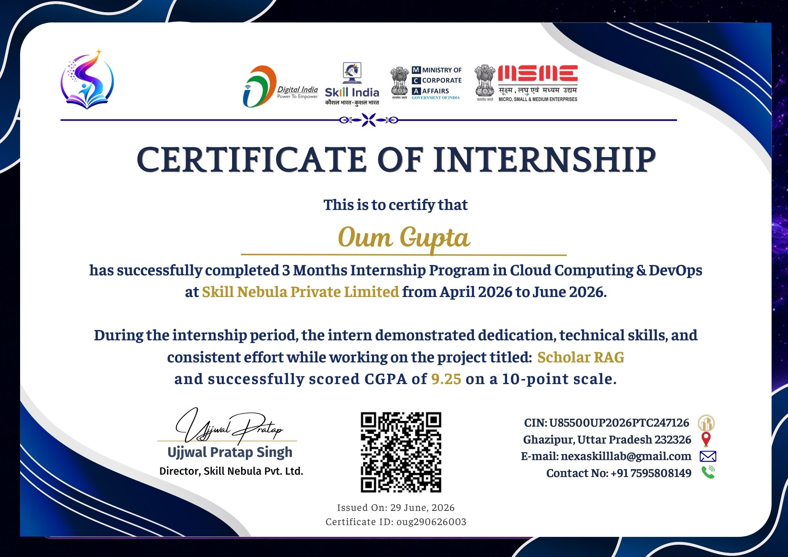

<div align="center">

# Schlorrag Internship Portfolio

### Retrieval-Augmented Generation (RAG) Research Assistant

[Project Documentation](ScholarRAG_Project_Documentlatest.pdf)

</div>

---

# Student Details

**Name:** Oum Gupta

**Email ID:** 24f3003029@ds.study.iitm.ac.in

**College Name:** IIT MADRAS (BS DEGREE)

**Branch/Specialization:** Data Science

**College ID:** 24f3003029

---

# Course Details

**Course Opted:** Cloud Computing and DevOps

**Instructor Name:** Mr. Ujjwal Pratap Singh

**Duration:** 3 Months

---

# Trainer Details

**Trainer Name:** Mr. Ujjwal Pratap Singh

**Trainer Email ID:** director@nexaskilllab.com

**Trainer Designation:** Director and Mentor

---

# Overall Learning

During this internship, I gained hands-on experience in building and deploying an end-to-end Retrieval-Augmented Generation system. The project provided practical exposure to backend API development, frontend integration, Docker, Kubernetes, AWS EC2, vector databases, GitHub collaboration, and cloud deployment.

---

# Project Completed

## Schlorrag

### Project Description

Schlorrag is an AI-powered research assistant that helps users discover research papers, retrieve relevant implementation repositories, and generate grounded answers using Retrieval-Augmented Generation.

### My Contributions

- Built the backend APIs for authentication, chat, retrieval, and recommendations.
- Integrated a React frontend with the FastAPI backend.
- Prepared research paper data for ingestion into the RAG pipeline.
- Implemented vector search using Qdrant and embedding models.
- Containerized the application with Docker.
- Added Kubernetes deployment manifests.
- Prepared project documentation and deployment assets.

---

# Repository Structure

```text
Schlorrag
|
|-- ScholarRAG/
|   |-- backend/
|   |-- frontend/
|   |-- ingestion/
|   |-- k8s/
|   |-- docker-compose.yml
|   `-- README.md
|-- ScholarRAG_Project_Documentlatest.pdf
|-- ss1.jpg
|-- ss2.jpg
|-- ss3.jpg
`-- README.md
```

---

# Technologies Used

- Python
- FastAPI
- React
- Docker
- Kubernetes
- AWS EC2
- Qdrant
- Sentence Transformers
- LangChain
- Hugging Face models
- SQLite
- Git
- GitHub
- Nginx
- Ingress

---


# Certificate




---

# Project Screenshots


---

# Acknowledgement

I sincerely thank my mentors **[Ujjwal Pratap Singh](https://www.linkedin.com/in/ujjwal-pratap-singh/?skipRedirect=true)** and **[Skill Nebula Private Limited](https://www.linkedin.com/company/skillnebula/posts/?feedView=all)** for their continuous guidance and support throughout this internship. This opportunity significantly enhanced my technical and professional skills.
